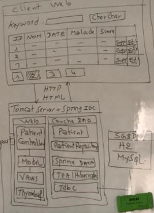

<h2> Compte Rendu </h2>
<h2>Application de gestion des patients</h2>
<h3>Table of Content</h3>

       *Introduction
       *Architecture
       

<h3> Introduction</h3>
Creer une Application web basee sur Spring MVC , Thymeleaf et spring Data JPA , qui permet de gerer des Patient.Cette derniere se compose de trois parties;

Partie1:
    
     -Afficher les Patients
     -Faire la Pagination
     -Chercher des Patients
     -Supprimer un Patient
Partie2: 

     - Creer une page template avec Thymleaf Layout
     -Saisir et Ajouter un Patient
     -Faire la Validation du Formulaire 
     -Editer et Mettre a jour un Patient
Partie3:

     -Securite avec Spring Security
<h3> Architecture </h3>

     

     